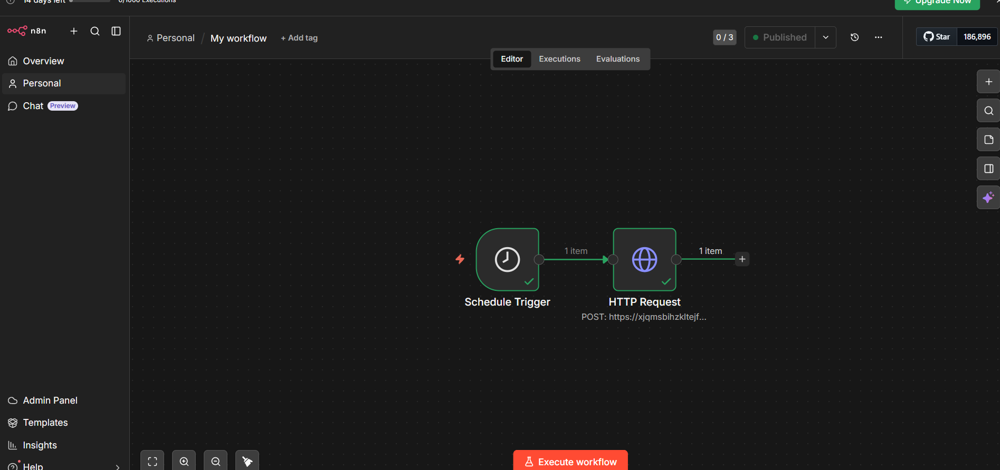
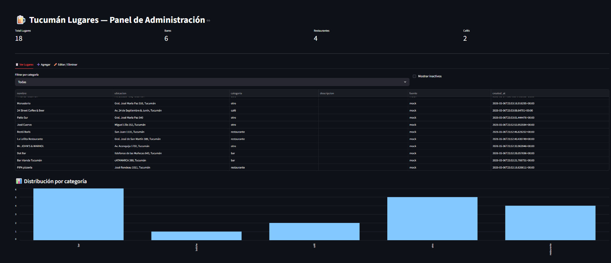

# 🍺 Tucumán Lugares — Sistema de Gestión Automatizada

Sistema que obtiene, procesa y administra bares y eventos de Tucumán de forma automatizada, usando IA para clasificación y detección de duplicados.

---

## 🚀 Stack utilizado

| Capa | Tecnología |
|------|-----------|
| Backend / API | Python + FastAPI |
| Base de datos | Supabase (PostgreSQL) |
| IA | Google Gemini 2.0 Flash |
| Automatización | n8n Cloud + Script Python |
| Dashboard | Streamlit |

---

## ▶️ Cómo correr el proyecto

```bash
# 1. Activar entorno virtual
venv\Scripts\activate

# 2. Levantar la API
uvicorn main:app --reload

# 3. Cargar datos mock (otra terminal)
python mock_data.py

# 4. Correr automatización manual
python automatizacion.py

# 5. Abrir dashboard
streamlit run dashboard.py
```

---

## 📁 Estructura del proyecto

```
tucuman-lugares/
├── main.py           → API REST con FastAPI (CRUD completo)
├── database.py       → Conexión a Supabase via HTTP
├── models.py         → Modelos de datos con Pydantic
├── ia.py             → Módulo de IA: clasificación, descripciones, duplicados
├── mock_data.py      → Carga inicial de datos de prueba
├── automatizacion.py → Flujo automatizado con logs
├── dashboard.py      → Panel visual con Streamlit
├── logs.json         → Registro de cada ejecución del flujo
└── .env              → Credenciales (no subir a git)
```

---

## 🔌 Endpoints de la API

| Método | Endpoint | Descripción |
|--------|----------|-------------|
| GET | `/lugares` | Lista todos los lugares activos |
| GET | `/lugares/{id}` | Obtiene un lugar por ID |
| POST | `/lugares` | Crea un nuevo lugar (con IA automática) |
| PUT | `/lugares/{id}` | Edita un lugar existente |
| DELETE | `/lugares/{id}` | Desactiva un lugar (soft delete) |

Documentación interactiva: `http://localhost:8000/docs`

---

## 🤖 Uso de IA (Parte 4)

La IA se aplica en **4 puntos clave**:

### 1. Clasificación automática
Cada lugar nuevo es clasificado en: `bar`, `boliche`, `café`, `restaurante`, `recital`, `cultural` u `otro`.
Usa doble estrategia: primero reglas por palabras clave (rápido, sin API), luego Gemini para casos ambiguos.

### 2. Generación de descripciones
Descripción atractiva en español rioplatense generada automáticamente.

### 3. Detección de duplicados semánticos
```
"Bar Irlanda Tucumán" vs "Irlanda Bar" → duplicado detectado ✅
```

### 4. Limpieza de nombres
Normaliza nombres inconsistentes o con caracteres raros.

---

## ⚙️ Automatización (Parte 3)

**1. Script Python (`automatizacion.py`)**
- Obtiene datos de la fuente externa
- Clasifica con IA
- Evita duplicados
- Registra logs en `logs.json`

**2. Flujo n8n Cloud**
- Se ejecuta automáticamente cada 24 horas
- Inserta nuevos registros directamente en Supabase
- Sin intervención manual

---

## 📋 Parte 5 — Criterio Técnico

### ¿Cómo evitás duplicados?

Doble capa de protección:

1. **Normalización por hash**: nombre en minúsculas, sin tildes, sin espacios extra. Si ya existe, se rechaza.
2. **Detección semántica con IA**: compara nombres para detectar variaciones como "Bar Irlanda" vs "Irlanda Bar".

### ¿Cómo escalarías este sistema?

- Índices en `nombre` y `categoria` en la base de datos
- Cola de tareas con Celery + Redis para llamadas a IA
- Workers independientes por fuente de scraping
- Deploy en Render o Railway con múltiples instancias
- Múltiples flujos en n8n por fuente de datos

### ¿Qué problemas puede tener este flujo?

| Problema | Descripción |
|----------|-------------|
| Scraping frágil | Si cambia el HTML de la fuente, el scraper se rompe |
| Rate limits de IA | Gemini tiene límites en el tier gratuito |
| Duplicados no detectados | Nombres muy distintos para el mismo lugar pueden pasar el filtro |
| Datos incompletos | Fuentes externas pueden no tener dirección o categoría |
| Sin autenticación | La API actual no tiene tokens de seguridad |

### ¿Cómo mejorarías la calidad de los datos?

1. **Aprobación manual**: revisión antes de publicar cada lugar nuevo
2. **Múltiples fuentes**: cruzar Google Places, redes sociales y scraping
3. **Feedback loop**: usuarios reportan errores para mejorar clasificación
4. **Normalización de direcciones**: Google Maps API para estandarizar
5. **Score de confianza**: puntaje por calidad de la fuente

---

## 🎁 Bonus implementados

- ✅ Dashboard visual con métricas y gráficos (Streamlit)
- ✅ Logs de cada ejecución (`logs.json`)
- ✅ Soft delete (desactivar en vez de borrar)
- ✅ Automatización programada con n8n Cloud
- ✅ Detección de duplicados con doble capa (hash + IA)
- ✅ Generación automática de descripciones con IA
- ✅ Sistema de corrección manual desde el dashboard
  ---

## 🔄 Evidencia de Automatización — n8n Cloud

El flujo en n8n Cloud se ejecuta automáticamente cada 24hs e inserta nuevos lugares directo en Supabase, sin intervención manual.

El script `automatizacion.py` complementa esto permitiendo ejecución bajo demanda con registro de logs locales.

**Flujo exportado:** `workflow_n8n.json`



## 📊 Dashboard

